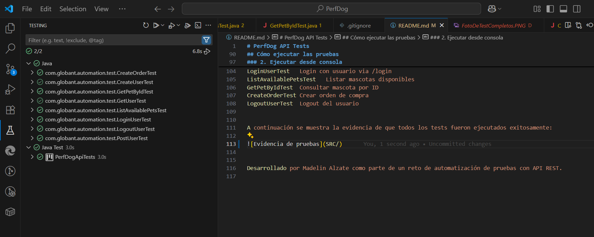

# PerfDog API Tests

Este proyecto automatiza pruebas de la API pública de PetStore (`https://petstore.swagger.io`) usando **Rest Assured**, **Java 17**, **TestNG** y **Maven**.

---

## Objetivo

Automatizar las siguientes funcionalidades expuestas por la API REST:

1. Crear un usuario
2. Hacer login del usuario
3. Listar mascotas con estado “disponible”
4. Consultar los datos de una mascota específica
5. Crear una orden de compra para una mascota
6. Hacer logout del usuario

Cada prueba es **independiente**, válida y sigue buenas prácticas de automatización de APIs.


A continuación se muestra la evidencia de que todos los tests fueron ejecutados exitosamente:



---

## Tecnologías y herramientas utilizadas
Este proyecto fue desarrollado para automatizar pruebas sobre la API pública de Petstore (https://petstore.swagger.io/) utilizando un enfoque modular y mantenible.

- Lenguajes y herramientas
Java 17 – Lenguaje principal para la automatización.
Maven – Gestor de dependencias y ciclo de vida del proyecto.
TestNG – Framework de ejecución de pruebas.
Rest Assured 5.3.1 – Librería para pruebas de servicios REST.
Lombok 1.18.28 – Generación automática de getters, setters y constructores para los DTOs.
Jackson (Databind 2.17.0) – Mapeo automático de objetos JSON a clases Java (serialización/deserialización).
Hamcrest 2.2 – Librería para validaciones y matchers en pruebas (opcional).

- Formatos de datos
Se usa JSON como formato de intercambio de datos con la API.

Las respuestas JSON se transforman en objetos Java mediante DTOs (Data Transfer Objects).Tecnologías utilizadas

- Java 17 (JDK de Eclipse Adoptium)
- Rest Assured 5.3.1
- Maven 3.9.10
- TestNG 7.5
- Lombok 1.18.28
- Jackson Databind 2.17.0

---

## Estructura del proyecto


PerfDogApiTests/

├── pom.xml                           ← Configuración de dependencias con Maven

├── README.md                         ← Documentación del proyecto

└── src/

    └── test/
    
        ├── java/
        
        │   └── com/
        
        │       └── globant/
        
        │           └── automation/
        
        │               ├── config/
        
        │               │   └── TestRunner.java            ← Clase base con setup general
        
        │               ├── model/
        
        │               │   └── users/
        
        │               │       └── UserDTO.java           ← Modelo de datos del usuario
        
        │               ├── request/
        
        │               │   └── RequestBuilder.java        ← Métodos para llamadas a la API
        
        │               └── test/
        
        │                   ├── CreateUserTest.java        ← Prueba para crear usuario
        
        │                   ├── LoginUserTest.java         ← Prueba de login
        
        │                   ├── ListAvailablePetsTest.java ← Prueba para listar mascotas disponibles
        
        │                   ├── GetPetByIdTest.java        ← Prueba para consultar mascota por ID
        
        │                   ├── CreateOrderTest.java       ← Prueba para crear orden de compra
        
        │                   └── LogoutUserTest.java        ← Prueba para logout
        
        └── resources/
        
            └── (opcional: archivos de configuración o datos)
            


Las clases de modelo (como UserDTO) representan la estructura esperada del cuerpo de las respuestas y peticiones.
La clase RequestBuilder centraliza la configuración de las peticiones HTTP (GET, POST, etc.).
Cada test es independiente y prueba funcionalidades específicas como crear usuario, login, consultar mascotas, y más.

- Buenas prácticas implementadas
Tests independientes entre sí.
Uso de DTOs para facilitar el mantenimiento y la validación de los datos.
Logging automático de peticiones y respuestas para depuración.
Separación clara por paquetes (config, model, request, test).

---

## Cómo ejecutar las pruebas

### 1. Requisitos previos
- Tener configurado correctamente el `JAVA_HOME` apuntando a JDK 17
- Tener configurado `MAVEN_HOME`
- Tener conexión a internet (la API es pública)

### 2. Ejecutar desde consola
```bash
mvn clean test

Cada Test cubre:
Clase	Funcionalidad probada
CreateUserTest	Crear usuario via /user
LoginUserTest	Login con usuario via /login
ListAvailablePetsTest	Listar mascotas disponibles
GetPetByIdTest	Consultar mascota por ID
CreateOrderTest	Crear orden de compra
LogoutUserTest	Logout del usuario


Desarrollado por Madelin Alzate como parte de un reto de automatización de pruebas con API REST.
